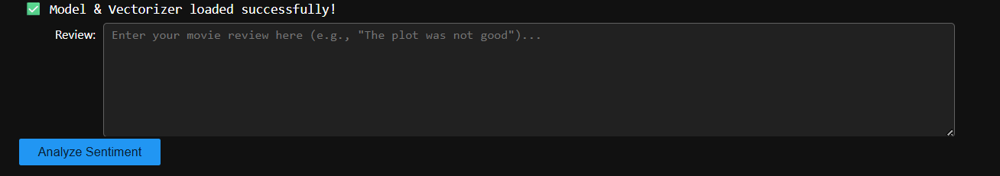
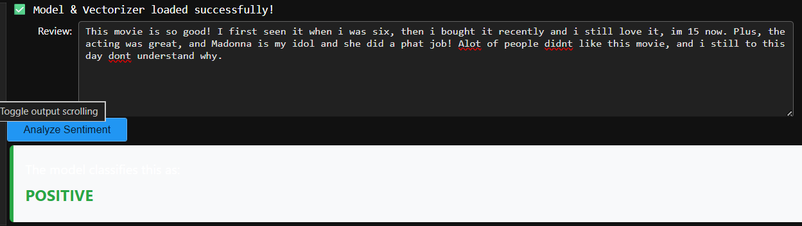
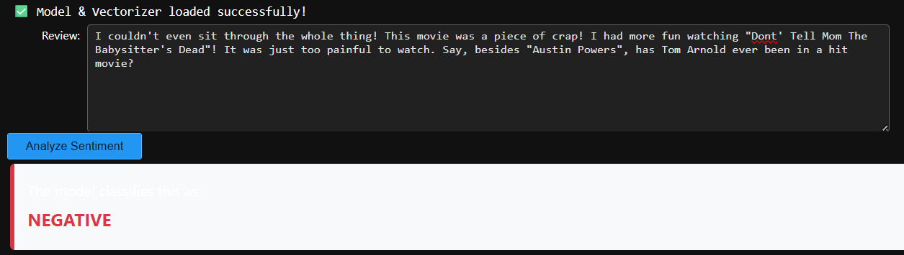

# IMDb Sentiment Classifier (SVM)

This project is a machine learning tool built using Support Vector Machines (SVM) to classify movie reviews into two categories: **Positive** and **Negative**. The model uses TF-IDF vectorization and a custom NLP pipeline specifically designed to handle **negation words** (like "not" or "never"), which are often lost in standard preprocessing.


## 📑 Table of Contents
- [📥Installation](#installation)
- [📊Dataset](#dataset)
- [🛠️Usage](#usage)
- [🏗️How I Built It](#how-i-built-it)
- [🚀Key Features](#key-features)
- [📂File Structure](#file-structure)
- [💻How to Run](#how-to-run)
- [🧠Model Architecture](#model-architecture)
- [📖Training](#training)
- [🌐API](#api)
- [📈Results](#results)


## 📥Installation

To run this project, you need Python installed along with the following libraries:

```bash
pip install scikit-learn nltk pandas joblib ipywidgets
```

## 📊Dataset
The dataset should be organized as follows:
```bash
movies_sentiment_analysis/
    data/
        sample_reviews.csv
    models/
        svm_model.joblib
        tfidf.joblib
    notebooks/
        1_Training.ipynb
        2_Predictor.ipynb
Where the data/ folder contains your CSV files and models/ contains your saved machine learning files.
```

## 🛠️Usage
1. Clone the repository and navigate to the project folder.
2. Update the variable path to the location where your dataset is stored.
3. Run the Jupyter Notebook or Python script to train the model on the dataset.

```bash
# Update your data path here
dataset_path = r"C:\path\to\your\project\data\sample_reviews.csv"
```

## 🏗️How I Built It
```bash
1. Data Collection: Used a dataset of movie reviews.
2. Text Preprocessing: 
   - Removed HTML tags and special characters.
   - Used Porter Stemming to reduce words to their roots.
   - Negation Handling: Customized the stopword list to keep words like "not" 
     and "no" so the model understands negative context.
3. Vectorization: Converted text to numbers using TF-IDF (Unigrams and Bigrams).
4. Model Training: Compared Linear, RBF, and Polynomial kernels. 
   The Linear Kernel performed best.
```

## 🚀Key Features
```bash
- Interactive Predictor: A Jupyter widget interface to test any review.
- Improved Accuracy: By keeping "not" in the text, the model correctly 
  identifies "not good" as Negative.
```

## 📂File Structure
```bash
- 1_Training.ipynb: The notebook where I cleaned data and trained the SVM.
- 2_Predictor.ipynb: The "API" notebook with the input box for testing.
- svm_model.joblib: The trained model weights.
- requirements.txt: The libraries needed to run this project.
```

## 💻How to Run
1. Clone this repository.
2. Install libraries:
```bash
pip install -r requirements.txt
```

## 🧠Model Architecture
The model consists of a text preprocessing pipeline followed by an SVM classifier. The architecture is as follows:

1. **Preprocessing:**
```bash
- HTML Tag Removal
- Custom Stopword Filtering (Negation Handling)
- Porter Stemming
```
1. **Feature Extraction:**
```bash
- TF-IDF Vectorization
- N-gram Range: (1, 2) (Unigrams and Bigrams)
```
1. **Classifier:**
```bash
- Support Vector Machine (SVM)
- Linear Kernel for high-dimensional text separation
```

## 📖Training
The model is trained using the Scikit-learn LinearSVC optimizer and TF-IDF features. The dataset is split into training (80%) and validation (20%) sets.
```bash
# Training the model
from sklearn.svm import LinearSVC
model = LinearSVC()
model.fit(X_train_tfidf, y_train)
```
### Save and Load the Model
After training, the model is saved as a Joblib file (svm_model.joblib). You can load the saved model for future predictions:

```bash
# Save the model
joblib.dump(model, 'svm_model.joblib')

# Load the saved model
savedModel = joblib.load('svm_model.joblib')
```

## 🌐API
### Step 1: Upload the Image
```bash
In this step, you will enter the text of the movie review you want to classify. 
The system allows you to type or paste a review into an interactive text area, 
which is then processed by the model for prediction.
```
Below is an example of the input screen:



### Step 2: View the Result
```bash
After the review is submitted, the model will predict whether the sentiment 
is Positive or Negative. The result will be displayed clearly with the 
predicted category name.
```
Below is an example of the result screen showing the model’s prediction:



In this case, the model successfully predicted that the input review is Positive



In this case, the model successfully predicted that the input review is Negative.

## 📈Results
```bash
The model is trained on the IMDb movie review dataset and successfully 
predicts sentiment categories. For example, a complex review is predicted as:
```
```bash
Predicted Sentiment: Positive
Predicted Sentiment: Negative
```


